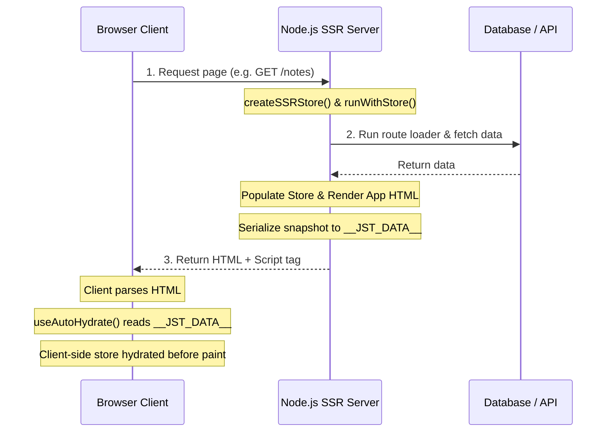

# Server-Side Rendering (SSR)

Server-Side Rendering (SSR) presents unique challenges for client-side state management libraries. Without proper isolation, concurrent requests can bleed state into one another, resulting in security vulnerabilities and data corruption. Additionally, rendering state on the server and recreating it on the client can cause UI flickering, double-fetching, and React hydration mismatches.

`jotai-state-tree` features a built-in, first-class SSR engine designed to address these problems. It guarantees complete request isolation via Node.js `AsyncLocalStorage`, facilitates zero-flicker client-side hydration, and integrates an RPC-based Server Actions engine with automatic state patch synchronization.

> [!TIP]
> **Instant Scaffold**: You can instantly scaffold a fully functional, production-ready SSR project pre-configured with routing, dark mode, dynamic devtools, and Server Actions by following the **[SSR Project Starter Guide](examples-and-templates.md#option-b-server-side-rendering-ssr-starter)**.

---

## Key Challenges & JST Solutions

### 1. Cross-Request State Bleeding
* **The Problem**: On an SSR server, a global singleton store (like those common in traditional state management libraries) is shared across all incoming requests. If Request A modifies the store, Request B will see those modifications, resulting in data leakage.
* **The Solution**: `jotai-state-tree` uses Node.js's `AsyncLocalStorage` via the `runWithStore` utility. This binds the active state tree and Jotai store scope to the current asynchronous execution context of the HTTP request. Even under high server concurrency, requests remain completely isolated.

### 2. Hydration Mismatches & UI Flicker
* **The Problem**: If the server renders HTML with certain data, but the client starts with empty default state, React will complain about a layout mismatch. If the client fetches data *after* mount, the user experiences a visible layout shift or "flicker".
* **The Solution**: The server serializes the state snapshot into a `<script id="__JST_DATA__">` tag. On mount, the client reads this snapshot and hydrates the underlying Jotai atoms before the first paint using `useHydrateStore` or `useAutoHydrate`, matching the server-rendered HTML precisely.

---

## Request Lifecycle Architecture

The diagram below maps the precise execution lifecycle of a request inside a `jotai-state-tree` SSR environment:



---

## Step-by-Step Server Setup

`jotai-state-tree` provides high-performance utilities to handle routing, page data-loading, and HTML rendering on Node.js server runtimes.

### 1. Define the Shared Store
Create a model that will be shared between the server and client:

```typescript
// store.ts
import { types } from 'jotai-state-tree';

export const Note = types.model('Note', {
  id: types.identifier,
  title: types.string,
  content: types.string,
});

export const RootStore = types.model('RootStore', {
  notes: types.array(Note),
}).actions(self => ({
  setNotes(notes: any[]) {
    self.notes.replace(notes);
  }
}));

export type IRootStore = typeof RootStore.Type;
```

### 2. Set Up the SSR Server Handler
Using `createSSRHandler`, you can construct an HTTP request handler that matches routes, runs data loaders, renders the React tree, and injects state snapshots into the HTML document.

```typescript
// server.ts
import http from 'node:http';
import React from 'react';
import ReactDOMServer from 'react-dom/server';
import { createSSRHandler, SSRRoute } from 'jotai-state-tree/ssr';
import { RootStore } from './store';
import { App } from './App';

// 1. Define server-side route loaders
const routes: SSRRoute<IRootStore>[] = [
  {
    path: '/notes',
    loader: async (store) => {
      // Fetch data from external API/Database
      const res = await fetch('https://api.example.com/notes');
      const data = await res.json();
      
      // Mutate the store directly.
      // This is safe: it runs inside runWithStore (request-isolated context).
      store.setNotes(data);
    }
  }
];

// 2. Define the page template
const template = `
<!DOCTYPE html>
<html>
<head>
  <title>SSR App</title>
  <!--app-state-->
</head>
<body>
  <div id="root"><!--app-html--></div>
  <script src="/client.js"></script>
</body>
</html>
`;

// 3. Create the SSR middleware handler
const handleSSR = createSSRHandler({
  createStore: () => RootStore.create({ notes: [] }),
  routes,
  template,
  renderApp: async (store, url) => {
    // Render the React application to a string
    return ReactDOMServer.renderToString(
      React.createElement(App, { store })
    );
  }
});

// 4. Start the Node HTTP server
const server = http.createServer(async (req, res) => {
  const handled = await handleSSR(req, res);
  if (!handled) {
    res.statusCode = 404;
    res.end('Not Found');
  }
});

server.listen(3000, () => {
  console.log('Server is listening on http://localhost:3000');
});
```

---

## Client-Side Hydration

On the client side, we must capture the pre-rendered state injected by the server and feed it back into `jotai-state-tree` before React mounts or paints the page.

### 1. Setup the Root App with Scoped Store
To prevent state leaks on the client and ensure we align with the server-bound Jotai instances, bind the global store instance dynamically.

```tsx
// App.tsx
import React, { useMemo } from 'react';
import { createStore } from 'jotai';
import { setGlobalStore } from 'jotai-state-tree';
import { createStoreContext } from 'jotai-state-tree/react';
import { RootStore, IRootStore } from './store';

export const { Provider, useStore } = createStoreContext<IRootStore>();

interface AppProps {
  store?: IRootStore;
}

export function App({ store }: AppProps) {
  // Client-side: instantiate a fresh scoped Jotai store to prevent global leaks
  useMemo(() => {
    if (typeof window !== 'undefined') {
      const jotaiStore = createStore();
      setGlobalStore(jotaiStore);
    }
  }, []);

  // Instantiate the store instance if not passed as a prop (for client entry)
  const storeInstance = useMemo(() => store || RootStore.create({ notes: [] }), [store]);

  return (
    <Provider value={storeInstance}>
      <MainLayout />
    </Provider>
  );
}
```

### 2. Auto-Hydration in Sub-Components
In the client entry component, use the `useAutoHydrate` hook. This hook automatically searches for the `<script id="__JST_DATA__">` tag, parses the JSON payload, hydrates the state tree atoms, and deletes the script tag reference to prevent duplicate hydration runs.

```tsx
// MainLayout.tsx
import React from 'react';
import { useAutoHydrate, useStoreSnapshot } from 'jotai-state-tree/react';
import { useStore } from './App';

export function MainLayout() {
  const store = useStore();
  
  // Hydrate the store before first paint
  useAutoHydrate(store);

  // Subscribe to hydrated state
  const notes = useStoreSnapshot(s => s.notes);

  return (
    <div>
      <h1>My Notes</h1>
      <ul>
        {notes.map(note => (
          <li key={note.id}>{note.title}</li>
        ))}
      </ul>
    </div>
  );
}
```

---

## Server Actions (RPC Engine)

One of the most powerful features of `jotai-state-tree` is its ability to perform mutations on the server and synchronize those updates back to the client state tree automatically via JSON patches.

### How it works:
1. The client declares a Server Action using `createServerAction`.
2. When the client executes this action, it automatically serializes the current local state snapshot and sends it along with the arguments via a `POST` request to `/api/_jst_action`.
3. The server receives the client snapshot, applies it to a fresh request-scoped store, and executes the server-side action.
4. During execution, any mutations are tracked by `onPatch` middleware on the server.
5. The server responds with the action return value and the collected JSON patches.
6. The client automatically applies those server patches back to its local state, executing optimistic mutations or syncing database updates transparently.

### Implementation Example

#### 1. Define Server Actions on Server
Register server actions in the `createSSRHandler` actions dictionary:

```typescript
// server.ts (continued)
import { createSSRHandler } from 'jotai-state-tree/ssr';

const handleSSR = createSSRHandler({
  createStore: () => RootStore.create({ notes: [] }),
  template,
  renderApp,
  
  // Register actions callable by clients
  actions: {
    createNoteOnServer: async (store, { title, content }) => {
      // 1. Write to database
      const dbResponse = await db.insert({ title, content });
      
      // 2. Mutate the server store
      // Any mutations here will generate JSON patches
      store.setNotes([...store.notes, dbResponse]);
      
      // 3. Return a response
      return { success: true, newId: dbResponse.id };
    }
  }
});
```

#### 2. Declare and Call on the Client
Use `createServerAction` to bind to the registered action name:

```typescript
// actions.ts (client-safe file)
import { createServerAction } from 'jotai-state-tree/react';

// Create a typed, callable server action
export const createNoteOnServer = createServerAction<{ title: string; content: string }, { success: boolean; newId: string }>('createNoteOnServer');
```

```tsx
// NoteEditor.tsx
import React, { useState } from 'react';
import { useStore } from './App';
import { createNoteOnServer } from './actions';

export function NoteEditor() {
  const store = useStore();
  const [title, setTitle] = useState('');
  const [content, setContent] = useState('');

  const handleCreate = async () => {
    // Calls the server action. 
    // Passes the client state snapshot and arguments to the server.
    // The server mutates its state and returns patches.
    // The client applies those patches automatically!
    const result = await createNoteOnServer(store, { title, content });
    console.log('Created note with ID:', result.newId);
  };

  return (
    <div>
      <input value={title} onChange={e => setTitle(e.target.value)} />
      <textarea value={content} onChange={e => setContent(e.target.value)} />
      <button onClick={handleCreate}>Save to Server</button>
    </div>
  );
}
```

---

## Detailed API Reference

### Server APIs (`jotai-state-tree/ssr` or `jotai-state-tree/dist/ssr`)

#### `createSSRStore()`
Creates and returns a fresh, isolated Jotai store instance.
* **Returns**: Jotai `Store` object.

#### `runWithStore(store, fn)`
Executes a callback within a request-scoped Jotai store context. Essential for preventing concurrent request state leaks.
* **Arguments**:
  - `store`: A Jotai store (created with `createSSRStore`).
  - `fn`: A callback function to run.
* **Returns**: The return value of the callback function.

#### `createSSRHandler(options)`
Creates a Node.js-compliant request handler middleware for SSR, server-side custom API routes, and Server Actions.
* **Options**:
  - `createStore`: `() => TStore` - Factory function to instantiate a fresh state tree.
  - `renderApp`: `(store: TStore, url: string) => Promise<string> | string` - Renders the app UI to a string.
  - `template`: `string | ((args: { html: string; state: string; req: any }) => Promise<string> | string)` - HTML shell template. Place `<!--app-html-->` and `<!--app-state-->` tokens to replace them, or provide a function.
  - `routes`: `SSRRoute[]` (Optional) - Matchable route configurations with loaders.
  - `actions`: `Record<string, (store: TStore, args: any) => any>` (Optional) - Named RPC actions.
  - `apiRoutes`: `Record<string, (req, res) => void>` (Optional) - Endpoint handlers mapped under `/api/*`.
* **Returns**: `(req, res) => Promise<boolean>` - Returns `true` if the request was handled, `false` otherwise.

#### `startSSRServer(options)`
Starts a standalone http server on the specified port.
* **Options**: All options from `createSSRHandler`, plus:
  - `port`: `number` (Optional, defaults to `3000`)
* **Returns**: Node `http.Server` instance.

---

### Client & React APIs (`jotai-state-tree/react`)

#### `useHydrateStore(target, snapshot, options?)`
Hydrates a state tree node (and all its child nodes) with a snapshot before the browser paints. Prevents React SSR layout mismatch warnings.
* **Arguments**:
  - `target`: The state tree node/instance.
  - `snapshot`: The plain JS object representing the tree state.
  - `options`: `{ store?: JotaiStore }` (Optional) - Scoped Jotai store override.

#### `useAutoHydrate(store)`
Reads, applies, and garbage-collects the server-serialized state snapshot embedded in `window.__JST_DATA__` (from `<script id="__JST_DATA__">`).
* **Arguments**:
  - `store`: The target root state tree node/instance.

#### `createServerAction(actionName)`
Defines an asynchronous function that executes server-side mutations, receives resulting JSON patches, and automatically reconciles client state.
* **Arguments**:
  - `actionName`: The name of the server action registered on the server handler.
* **Returns**: `(store, args) => Promise<any>` - A function callable on the client.

---

## Best Practices

1. **Clean up hydration scripts**: If you use `useHydrateStore` manually, ensure you delete the global snapshot reference after hydration is complete to avoid re-hydrating the store with old data on subsequent component mounts. `useAutoHydrate` handles this cleanup automatically.
2. **Context Isolation**: Always wrap your store instances inside context Providers using `createStoreContext` on both server and client. Avoid referencing global variables directly in components, as this breaks server concurrency isolation.
3. **Optimistic Updates**: You can perform optimistic mutations on the client state before calling a Server Action. If the server action fails, you can catch the error and rollback state using snapshots, or let the server patches reconcile database changes.
4. **Volatile Properties**: Keep third-party socket connections, timers, and raw HTML elements in `volatile` properties (e.g. `.volatile(() => ({ socket: null }))`). Volatile state is not serialized in snapshots, ensuring that `__JST_DATA__` stays clean and lightweight.
